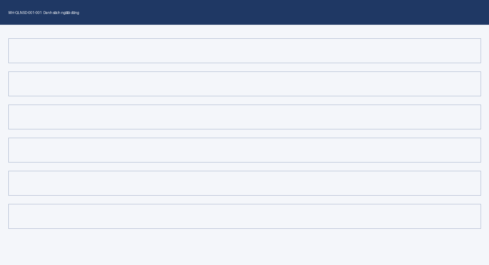
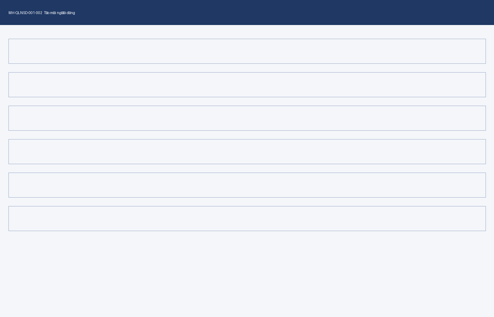

# Chức năng [FUNC-QLNSD-001] Quản lý người dùng

## Mô tả chung

| Hạng mục | Nội dung |
|---|---|
| Loại chức năng | UI |
| Mã chức năng | FUNC-QLNSD-001 |
| Tên chức năng | Quản lý người dùng |
| Nhóm chức năng | GRP-QLNSD-01 |
| Mô tả chức năng | Quản trị viên tra cứu, tạo mới và ngừng hiệu lực tài khoản người dùng nội bộ. |
| Trong phạm vi | Tra cứu, tạo mới và ngừng hiệu lực tài khoản; gán vai trò đã tồn tại cho tài khoản. |
| Ngoài phạm vi | Tạo/sửa vai trò thuộc FUNC-QLNSD-002. Xác thực đăng nhập và đổi mật khẩu thuộc FUNC-QLNSD-003. Đồng bộ tài khoản từ AD không thuộc phiên bản này. |
| Tác nhân chính |  |
| Tác nhân phụ |  |
| Vị trí chức năng | Quản trị hệ thống › Người dùng |
| Điều kiện tiên quyết | Người dùng đã đăng nhập và giữ vai trò có quyền truy cập theo Ma trận phân quyền. |
| Hậu điều kiện | Tài khoản được tạo ở trạng thái ST-NGUOIDUNG-01. Mọi thay đổi được ghi vào nhật ký truy cập. |
| Chức năng tiền đề | FUNC-QLNSD-002 — Quản lý vai trò. Vai trò phải tồn tại trước khi gán cho tài khoản. |
| Chức năng kế tiếp | Không áp dụng |
| Chức năng dùng chung | CMP-GRID-001 — lưới dữ liệu có phân trang và sắp xếp. |
| Yêu cầu đặc thù | Không áp dụng |

## Truy vết yêu cầu

| Mã UC | Tên UC | Tính năng đáp ứng | Vai trò | Mức đáp ứng | Ghi chú |
|---|---|---|---|---|---|
| UC-0301 |  | FEAT-QLNSD-001-01 | Chính | Đầy đủ |  |
| UC-0302 |  | FEAT-QLNSD-001-02 | Chính | Đầy đủ |  |

## Ma trận phân quyền

| STT | Mã tính năng | Tính năng / Thao tác | ROLE-QTHT | ROLE-QTDV | ROLE-NVNV | Phạm vi dữ liệu |
|---|---|---|---|---|---|---|
| 1 | FEAT-QLNSD-001-01 | Tra cứu danh sách người dùng | X | X | X | ROLE-QTHT: toàn hệ thống. ROLE-QTDV và ROLE-NVNV: đơn vị của người dùng đăng nhập. |
| 2 | FEAT-QLNSD-001-02 | Tạo mới người dùng | X | X |  | ROLE-QTDV chỉ tạo được tài khoản thuộc đơn vị của mình. |

## Danh sách màn hình

| STT | Mã màn hình | Tên màn hình | Tính năng sử dụng | Mô tả |
|---|---|---|---|---|
| 1 | MH-QLNSD-001-001 | Danh sách người dùng | FEAT-QLNSD-001-01 | Lưới kết quả kèm vùng điều kiện tìm kiếm. |
| 2 | MH-QLNSD-001-002 | Tạo mới người dùng | FEAT-QLNSD-001-02 | Biểu mẫu nhập thông tin tài khoản. |

## Luồng màn hình

Từ MH-QLNSD-001-001, người dùng chọn “Thêm mới” để mở MH-QLNSD-001-002. Sau khi lưu thành công, hệ thống đóng MH-QLNSD-001-002 và quay về MH-QLNSD-001-001 với điều kiện tìm kiếm được giữ nguyên.

## Sơ đồ trạng thái

Tài khoản người dùng có ba trạng thái:

- ST-NGUOIDUNG-01 — Đang hoạt động. Trạng thái khi vừa tạo.
- ST-NGUOIDUNG-02 — Tạm khoá. Chuyển từ ST-NGUOIDUNG-01 khi quản trị viên khoá tài khoản, và chuyển ngược lại được.
- ST-NGUOIDUNG-03 — Ngừng hiệu lực. Chuyển từ ST-NGUOIDUNG-01 hoặc ST-NGUOIDUNG-02, không chuyển ngược lại.

## Luồng nghiệp vụ

Quản trị viên tra cứu danh sách để xác định tài khoản đã tồn tại hay chưa. Nếu chưa có, quản trị viên tạo tài khoản mới và gán vai trò. Hệ thống sinh mật khẩu tạm và gửi qua thư điện tử; người dùng đổi mật khẩu ở lần đăng nhập đầu tiên, việc này thuộc phạm vi FUNC-QLNSD-003.

## Quy tắc nghiệp vụ

| Mã quy tắc | Nội dung quy tắc | Áp dụng cho | Mã thông báo khi vi phạm |
|---|---|---|---|
| BR-QLNSD-001-001 | Tên đăng nhập là duy nhất trên toàn hệ thống, không phân biệt chữ hoa chữ thường. | FEAT-QLNSD-001-02 | ERR_101 |
| BR-QLNSD-001-002 | Tên đăng nhập chỉ chứa chữ cái không dấu, chữ số và dấu chấm; dài từ 6 đến 32 ký tự. | FEAT-QLNSD-001-02 | ERR_102 |
| BR-QLNSD-001-003 | Thư điện tử là duy nhất trên toàn hệ thống. | FEAT-QLNSD-001-02 | ERR_103 |
| BR-QLNSD-001-004 | Mỗi tài khoản được gán ít nhất một vai trò. | FEAT-QLNSD-001-02 | ERR_104 |
| BR-QLNSD-001-005 | ROLE-QTDV chỉ tạo được tài khoản thuộc đơn vị của mình. | FEAT-QLNSD-001-02 | ERR_105 |
| BR-QLNSD-001-006 | Tài khoản ở trạng thái ST-NGUOIDUNG-03 không hiển thị trong kết quả tra cứu mặc định. | FEAT-QLNSD-001-01 | Không áp dụng |

## Tính năng [FEAT-QLNSD-001-01] Tra cứu danh sách người dùng

### Mô tả yêu cầu

Quản trị viên tìm tài khoản theo tên đăng nhập, họ tên, đơn vị, vai trò và trạng thái. Kết quả trả về theo phạm vi dữ liệu của vai trò người dùng đăng nhập. Tài khoản ở trạng thái ST-NGUOIDUNG-03 bị loại khỏi kết quả trừ khi người dùng chọn trạng thái đó ở điều kiện tìm kiếm.

### Luồng xử lý

**Luồng chính**

| Bước | Tác nhân | Hành động | Phản hồi của hệ thống |
|---|---|---|---|
| 1 | Quản trị viên | Mở MH-QLNSD-001-001 | Hiển thị vùng điều kiện tìm kiếm và lưới rỗng. |
| 2 | Quản trị viên | Nhập điều kiện và chọn “Tìm kiếm” | Kiểm tra điều kiện theo BR-QLNSD-001-006, truy vấn theo phạm vi dữ liệu của vai trò. |
| 3 | Hệ thống | — | Hiển thị kết quả phân trang 20 dòng mỗi trang, sắp xếp mặc định theo ngày tạo giảm dần. |

**Luồng thay thế**

| Mã luồng | Điều kiện rẽ nhánh | Xử lý | Quay về bước |
|---|---|---|---|
| ALT-01 | Không có điều kiện nào được nhập | Truy vấn toàn bộ theo phạm vi dữ liệu của vai trò. | 3 |

**Luồng ngoại lệ**

| Mã luồng | Tình huống ngoại lệ | Xử lý của hệ thống | Mã thông báo |
|---|---|---|---|
| EXC-01 | Không có bản ghi nào khớp | Giữ nguyên điều kiện, hiển thị lưới rỗng kèm thông báo. | INF_001 |
| EXC-02 | Truy vấn quá thời gian chờ | Huỷ truy vấn, giữ nguyên điều kiện đã nhập. | ERR_002 |

### Thiết kế giao diện

### Mô tả các thành phần trên giao diện

| STT | Tên thành phần | Kiểu dữ liệu / Loại control | Bắt buộc / Giá trị mặc định | Giới hạn | Mô tả ràng buộc |
|---|---|---|---|---|---|
| 1 | Tên đăng nhập | Ô nhập văn bản | Không | tối đa 32 ký tự | Tìm kiếm khớp một phần, không phân biệt chữ hoa chữ thường. |
| 2 | Họ và tên | Ô nhập văn bản | Không | tối đa 100 ký tự | Tìm kiếm khớp một phần. |
| 3 | Đơn vị | Danh sách chọn | Không / trống | — | Nguồn: danh mục đơn vị. ROLE-QTDV chỉ thấy đơn vị của mình. |
| 4 | Vai trò | Danh sách chọn nhiều | Không / trống | — | Nguồn: roles.csv. Chọn nhiều vai trò thì lấy quan hệ hoặc. |
| 5 | Trạng thái | Danh sách chọn | Không / “Đang hoạt động” | — | Nguồn: states.csv, nhóm NGUOIDUNG. Áp dụng BR-QLNSD-001-006. |
| 6 | Lưới kết quả | CMP-GRID-001 | — | 20 dòng mỗi trang | Cột: tên đăng nhập, họ tên, đơn vị, vai trò, trạng thái, ngày tạo. |

### Xử lý sự kiện và thao tác

| STT | Sự kiện / Thao tác | Điều kiện | Xử lý của hệ thống | Kết quả / Mã thông báo |
|---|---|---|---|---|
| 1 | Chọn “Tìm kiếm” | Luôn | Truy vấn theo điều kiện và phạm vi dữ liệu của vai trò. | Cập nhật lưới. Không có kết quả thì INF_001. |
| 2 | Chọn “Xoá điều kiện” | Luôn | Đặt lại toàn bộ điều kiện về giá trị mặc định, xoá kết quả. | Lưới trở về rỗng. |
| 3 | Chọn tiêu đề cột | Lưới có dữ liệu | Sắp xếp theo cột được chọn, đảo chiều nếu chọn lại. | Cập nhật lưới, giữ nguyên trang hiện tại. |
| 4 | Chuyển trang | Lưới có nhiều hơn một trang | Truy vấn trang tương ứng, giữ nguyên điều kiện và thứ tự sắp xếp. | Cập nhật lưới. |
| 5 | Chọn “Thêm mới” | Vai trò có quyền theo Ma trận phân quyền | Mở MH-QLNSD-001-002. | Chuyển màn hình. |

### Thông báo

| STT | Mã thông báo | Loại | Nội dung | Tham số | Điều kiện phát sinh |
|---|---|---|---|---|---|
| 1 | INF_001 | Inline | Không tìm thấy dữ liệu phù hợp. |  | Truy vấn trả về không bản ghi nào. |
| 2 | ERR_002 | Toast | Hệ thống đang bận. Vui lòng thử lại sau. |  | Truy vấn vượt thời gian chờ. |

### Tiêu chí chấp nhận

| STT | Tiêu chí — «Khi … thì hệ thống phải …» | Mã BR liên quan |
|---|---|---|
| 1 | Khi ROLE-QTDV tìm kiếm không nhập điều kiện, hệ thống chỉ trả về tài khoản thuộc đơn vị của người dùng đăng nhập. | Không áp dụng |
| 2 | Khi không chọn trạng thái, hệ thống loại tài khoản ST-NGUOIDUNG-03 khỏi kết quả. | BR-QLNSD-001-006 |
| 3 | Khi chọn trạng thái “Ngừng hiệu lực”, hệ thống trả về tài khoản ST-NGUOIDUNG-03. | BR-QLNSD-001-006 |
| 4 | Khi truy vấn không có kết quả, hệ thống giữ nguyên điều kiện đã nhập và hiển thị INF_001. | Không áp dụng |
| 5 | Khi chuyển trang, hệ thống giữ nguyên điều kiện tìm kiếm và thứ tự sắp xếp. | Không áp dụng |

## Tính năng [FEAT-QLNSD-001-02] Tạo mới người dùng

### Mô tả yêu cầu

Quản trị viên tạo tài khoản mới bằng cách nhập thông tin định danh và gán ít nhất một vai trò. Hệ thống kiểm tra trùng lặp theo BR-QLNSD-001-001 và BR-QLNSD-001-003 trước khi ghi. Tài khoản được tạo ở trạng thái ST-NGUOIDUNG-01. Mật khẩu tạm được sinh tự động và gửi tới thư điện tử đã khai báo.

### Luồng xử lý

**Luồng chính**

| Bước | Tác nhân | Hành động | Phản hồi của hệ thống |
|---|---|---|---|
| 1 | Quản trị viên | Mở MH-QLNSD-001-002 | Hiển thị biểu mẫu rỗng, danh sách đơn vị lọc theo phạm vi của vai trò. |
| 2 | Quản trị viên | Nhập thông tin và chọn “Lưu” | Kiểm tra BR-QLNSD-001-001 đến BR-QLNSD-001-005. |
| 3 | Hệ thống | — | Ghi tài khoản ở trạng thái ST-NGUOIDUNG-01, sinh mật khẩu tạm, gửi MAIL_001. |
| 4 | Hệ thống | — | Đóng MH-QLNSD-001-002, quay về MH-QLNSD-001-001, hiển thị SUC_001. |

**Luồng thay thế**

| Mã luồng | Điều kiện rẽ nhánh | Xử lý | Quay về bước |
|---|---|---|---|
| ALT-01 | Quản trị viên chọn “Huỷ” | Đóng biểu mẫu, không ghi dữ liệu. Có thay đổi chưa lưu thì hỏi xác nhận bằng CONF_001. | — |

**Luồng ngoại lệ**

| Mã luồng | Tình huống ngoại lệ | Xử lý của hệ thống | Mã thông báo |
|---|---|---|---|
| EXC-01 | Tên đăng nhập đã tồn tại | Giữ nguyên dữ liệu đã nhập, đánh dấu trường vi phạm. | ERR_101 |
| EXC-02 | Thư điện tử đã tồn tại | Giữ nguyên dữ liệu đã nhập, đánh dấu trường vi phạm. | ERR_103 |
| EXC-03 | Ghi thành công nhưng gửi MAIL_001 thất bại | Giữ tài khoản đã tạo, ghi nhật ký lỗi gửi thư. | WAR_001 |

### Thiết kế giao diện

### Mô tả các thành phần trên giao diện

| STT | Tên thành phần | Kiểu dữ liệu / Loại control | Bắt buộc / Giá trị mặc định | Giới hạn | Mô tả ràng buộc |
|---|---|---|---|---|---|
| 1 | Tên đăng nhập | Ô nhập văn bản | Có | 6–32 ký tự | Áp dụng BR-QLNSD-001-001 và BR-QLNSD-001-002. Vi phạm thì ERR_101 hoặc ERR_102. |
| 2 | Họ và tên | Ô nhập văn bản | Có | tối đa 100 ký tự | Không chứa chữ số. |
| 3 | Thư điện tử | Ô nhập văn bản | Có | tối đa 150 ký tự | Áp dụng BR-QLNSD-001-003. Vi phạm thì ERR_103. |
| 4 | Đơn vị | Danh sách chọn | Có | — | Nguồn: danh mục đơn vị. Áp dụng BR-QLNSD-001-005. |
| 5 | Vai trò | Danh sách chọn nhiều | Có | tối đa 5 vai trò | Nguồn: roles.csv. Áp dụng BR-QLNSD-001-004. Vi phạm thì ERR_104. |
| 6 | Ghi chú | Ô nhập nhiều dòng | Không | tối đa 500 ký tự | Không áp dụng ràng buộc nội dung. |

### Xử lý sự kiện và thao tác

| STT | Sự kiện / Thao tác | Điều kiện | Xử lý của hệ thống | Kết quả / Mã thông báo |
|---|---|---|---|---|
| 1 | Rời khỏi ô “Tên đăng nhập” | Ô có giá trị | Kiểm tra BR-QLNSD-001-002 tại chỗ. | Vi phạm thì ERR_102 dạng inline. |
| 2 | Chọn “Lưu” | Luôn | Kiểm tra toàn bộ quy tắc, ghi dữ liệu, gửi thư điện tử. | Thành công thì SUC_001. Vi phạm thì dừng và hiển thị mã tương ứng. |
| 3 | Chọn “Huỷ” | Luôn | Có thay đổi chưa lưu thì hỏi CONF_001, không có thì đóng ngay. | Đóng biểu mẫu, không ghi dữ liệu. |
| 4 | Đổi giá trị “Đơn vị” | ROLE-QTDV đăng nhập | Chỉ cho chọn đơn vị của người dùng đăng nhập. | Danh sách chỉ có một lựa chọn. |

### Thông báo

| STT | Mã thông báo | Loại | Nội dung | Tham số | Điều kiện phát sinh |
|---|---|---|---|---|---|
| 1 | SUC_001 | Toast | Tạo {doi_tuong} thành công. | doi_tuong = NGUOIDUNG | Ghi dữ liệu thành công. |
| 2 | ERR_101 | Inline | Tên đăng nhập đã tồn tại. Vui lòng chọn tên khác. |  | Vi phạm BR-QLNSD-001-001. |
| 3 | ERR_102 | Inline | Tên đăng nhập chỉ gồm chữ cái không dấu, chữ số và dấu chấm, dài 6–32 ký tự. |  | Vi phạm BR-QLNSD-001-002. |
| 4 | ERR_103 | Inline | Thư điện tử đã được sử dụng cho tài khoản khác. |  | Vi phạm BR-QLNSD-001-003. |
| 5 | ERR_104 | Inline | Vui lòng chọn ít nhất một vai trò. |  | Vi phạm BR-QLNSD-001-004. |
| 6 | ERR_105 | Toast | Bạn chỉ được tạo tài khoản thuộc đơn vị của mình. |  | Vi phạm BR-QLNSD-001-005. |
| 7 | WAR_001 | Toast | Đã tạo {doi_tuong} nhưng chưa gửi được thư thông báo. | doi_tuong = NGUOIDUNG | Gửi thư điện tử thất bại sau khi ghi thành công. |
| 8 | CONF_001 | Modal | Thông tin chưa lưu sẽ bị mất. Bạn có chắc muốn đóng? |  | Chọn “Huỷ” khi biểu mẫu có thay đổi chưa lưu. |
| 9 | MAIL_001 | Email | Thư cấp tài khoản — gửi tên đăng nhập và mật khẩu tạm cho {ten_nguoi_nhan}. | ten_nguoi_nhan = NGUOIDUNG | Ghi tài khoản thành công. Tiêu đề và nội dung đầy đủ ở messages.csv. |

### Tiêu chí chấp nhận

| STT | Tiêu chí — «Khi … thì hệ thống phải …» | Mã BR liên quan |
|---|---|---|
| 1 | Khi tên đăng nhập trùng tài khoản đã có, hệ thống dừng việc ghi và hiển thị ERR_101. | BR-QLNSD-001-001 |
| 2 | Khi thư điện tử trùng tài khoản đã có, hệ thống dừng việc ghi và hiển thị ERR_103. | BR-QLNSD-001-003 |
| 3 | Khi không chọn vai trò nào, hệ thống dừng việc ghi và hiển thị ERR_104. | BR-QLNSD-001-004 |
| 4 | Khi ROLE-QTDV chọn đơn vị khác đơn vị của mình, hệ thống dừng việc ghi và hiển thị ERR_105. | BR-QLNSD-001-005 |
| 5 | Khi ghi thành công, hệ thống tạo tài khoản ở trạng thái ST-NGUOIDUNG-01. | Không áp dụng |
| 6 | Khi ghi thành công nhưng gửi thư thất bại, hệ thống giữ tài khoản đã tạo và hiển thị WAR_001. | Không áp dụng |

## Dữ liệu và tích hợp

| STT | Loại | Tên đối tượng | Chiều | Mô tả / Ghi chú |
|---|---|---|---|---|
| 1 | Bảng CSDL | NGUOIDUNG | Đọc, Ghi | Bảng chính của chức năng. |
| 2 | Bảng CSDL | NGUOIDUNG_VAITRO | Đọc, Ghi | Quan hệ tài khoản với vai trò. |
| 3 | Bảng CSDL | DONVI | Đọc | Nguồn danh sách đơn vị. |
| 4 | Bảng CSDL | NHATKY_TRUYCAP | Ghi | Ghi vết thao tác tạo và tra cứu. |
| 5 | API | Dịch vụ gửi thư điện tử | Ra | Gửi mật khẩu tạm. Thất bại thì WAR_001. |

## Phân loại dữ liệu

| STT | Trường / Nhóm dữ liệu | Phân loại | Quy tắc che | Ghi nhật ký | Thời hạn lưu |
|---|---|---|---|---|---|
| 1 | Họ và tên | Định danh cá nhân | Hiển thị đầy đủ | Thao tác tạo và sửa | Theo vòng đời tài khoản |
| 2 | Thư điện tử | Định danh cá nhân | Che một phần ở lưới kết quả, đầy đủ ở màn hình chi tiết | Thao tác tạo và sửa | Theo vòng đời tài khoản |
| 3 | Mật khẩu tạm | Nhạy cảm | Không hiển thị ở bất kỳ màn hình nào | Chỉ ghi sự kiện sinh mật khẩu, không ghi giá trị | Không lưu sau khi gửi |
| 4 | Tên đăng nhập | Nội bộ | Hiển thị đầy đủ | Thao tác tạo | Theo vòng đời tài khoản |

## Vấn đề còn mở

| STT | Nội dung vấn đề | Người quyết định | Hạn chốt | Trạng thái |
|---|---|---|---|---|

## Lịch sử thay đổi
